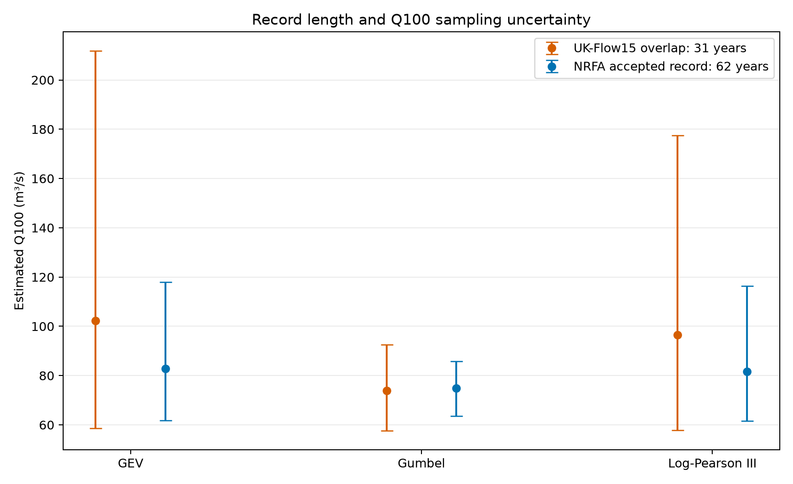
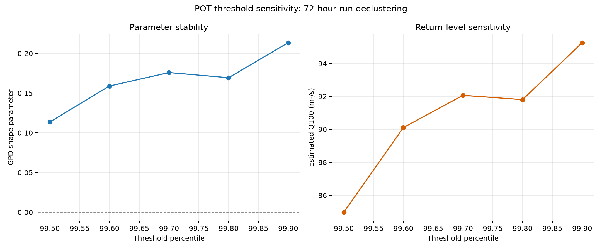
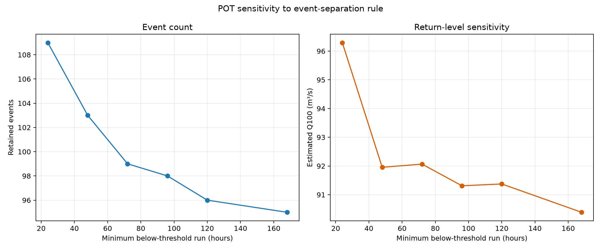
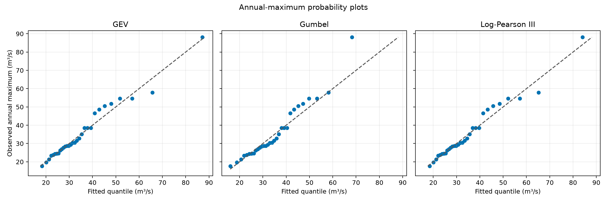
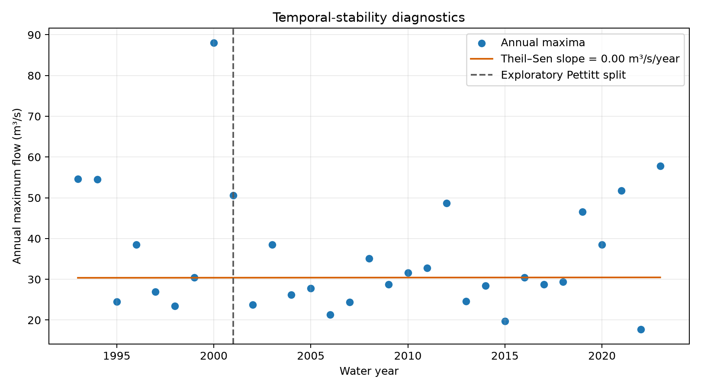
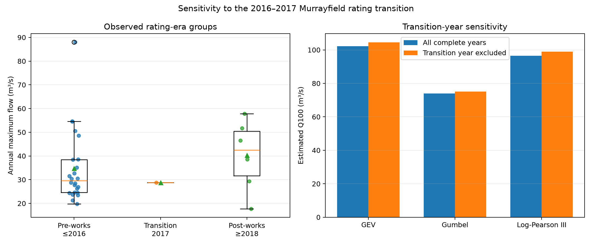

# Flood hydrology of the Water of Leith at Murrayfield

[](https://github.com/MohaAbdipour/water-of-leith-flood-hydrology/actions/workflows/tests.yml)

This study examines the observed high-flow regime of the Water of Leith at
Murrayfield, Edinburgh (NRFA station 19006; UK-Flow15 station 019006). It uses
15-minute discharge observations to construct a hydrological water-year annual
maximum series and quantify how design-flow estimates depend on statistical
model choice and sampling uncertainty.

The Murrayfield gauge drains 107 km². The catchment is described by the National
River Flow Archive as relatively impervious and flashy, with urban influence,
combined sewer overflows, three headwater reservoirs and regulated runoff. The
gauging record also requires care because hydraulic controls and flood-defence
works have affected the stage–discharge relation.

## Data

The analysis uses **UK-Flow15**, an openly licensed, quality-controlled national
archive of sub-hourly discharge:

> Fileni, F. et al. (2025). *Sub-hourly river flow data observations from 1369
> river gauges in the UK, 1948–2023 (UK-Flow15).* NERC EDS Environmental
> Information Data Centre. https://doi.org/10.5285/211710ac-f01b-4b52-807f-373babb1c368

The dataset is available under the UK Open Government Licence. Raw data are not
duplicated in this repository; the download script retrieves station `019006`
and its metadata directly from the official catalogue. This keeps provenance
explicit and avoids maintaining an uncontrolled copy of the source archive.

## Analytical workflow

### 1. Data acquisition and provenance

Fifteen-minute discharge observations for the Water of Leith at Murrayfield
were obtained from UK-Flow15. Dataset origin, licence, station identity and
retrieval procedures were documented to maintain traceability and reproducibility.

### 2. Hydrometric quality control

The record was assessed for missing values, duplicate timestamps, irregular
intervals, negative flows and UK-Flow15 quality flags. The sequence is complete,
and the four flagged high flows have supporting hydrometeorological validation.

### 3. Annual-maximum extraction

The highest discharge in each complete October–September water year was
extracted. Partial boundary years were excluded, producing 31 annual maxima for
water years 1993–2023.

### 4. Independent NRFA validation

The extracted maxima were compared locally with the restricted NRFA Peak Flow
Dataset v15. All 31 overlapping peak magnitudes and dates match, confirming that
the UK-Flow15 extraction reproduces the current NRFA peak record for the common
period.

### 5. QMED estimation

The median annual maximum was calculated as an at-site diagnostic statistic.
The 62-year accepted NRFA record gives QMED = 31.00 m³/s, but the station's NRFA
classification means this is not presented as an approved design value.

### 6. Flood-frequency modelling

GEV, Gumbel and Log-Pearson III distributions were fitted by maximum likelihood.
Their return-level estimates were compared to quantify the sensitivity of rare-
flood estimates to the assumed upper-tail model.

### 7. Uncertainty analysis

Non-parametric bootstrap resampling was used to refit every distribution and
derive 95% intervals. The resulting Q100 intervals represent sampling and
parameter uncertainty, not the full uncertainty in the hydrometric record.

### 8. Record-length sensitivity

Estimates from the 31-year open record were compared with results from 62
accepted NRFA maxima. The longer record reduces upper-tail uncertainty and
moderates the GEV and Log-Pearson III Q100 estimates.

### 9. Relation to FEH practice

The analysis provides a transparent statistical baseline informed by UK flood-
estimation practice. It is not a formal FEH assessment because licensed FEH
descriptors, donor adjustment, pooling procedures and proprietary software were
not used.

### 10. Interpretation and limitations

Interpretation considers rating uncertainty, hydraulic controls, reservoir
regulation, urban influence and the 2016–2017 flood-defence works. The results
are scientific diagnostics and are not suitable for engineering design or
operational flood management.

## Record integrity

The downloaded station file contains 1,107,420 observations from 1 June 1992 to
31 December 2023. Checks found:

- no missing discharge values;
- no duplicate timestamps;
- no breaks in the 15-minute sequence;
- no negative flows;
- four `006` observations, denoting high flows validated by antecedent rainfall
  and concurrent regional high flow in the UK-Flow15 documentation.

Only complete October–September water years are retained, giving 31 annual
maxima for water years 1993–2023.

## Initial results


The at-site median annual flood, calculated directly from the observed annual
maxima, is **QMED = 30.41 m³/s**. The largest value is **88.08 m³/s** in water
year 2000.


| Model | Q10 (m³/s) | Q100 (m³/s) | Bootstrap 95% interval for Q100 (m³/s) |
|---|---:|---:|---:|
| GEV | 53.86 | 102.20 | 58.66–211.77 |
| Gumbel | 51.20 | 73.92 | 57.64–92.59 |
| Log-Pearson III | 54.15 | 96.49 | 57.71–177.53 |

The similar Q10 estimates but divergent Q100 estimates show how strongly tail
assumptions influence extrapolation beyond a 31-year record. The intervals are
non-parametric bootstrap intervals that refit each model in every resample; they
represent sampling and parameter uncertainty, but not rating-curve, temporal
non-stationarity or model-structure uncertainty.

## Validation against NRFA Peak Flow Dataset v15

The locally held NRFA annual-maximum file was used as a restricted validation
reference and is excluded from version control. Across all 31 overlapping water
years, UK-Flow15 and NRFA v15 have:

- 31/31 matching peak magnitudes to 0.001 m³/s;
- 31/31 matching peak dates;
- mean bias, MAE and RMSE of 0.000 m³/s;
- Pearson correlation of 1.000.

The agreement establishes that the annual maxima extracted from UK-Flow15
reproduce the current authoritative peak-flow record over their common period.
It does not independently validate the underlying stage–discharge rating.

The NRFA file contains 64 recorded maxima and lists three rejected water years;
two rejected years have values present in the AMAX section. Removing rejected
values leaves 62 accepted maxima spanning water years 1962–2025. Analysis of
that longer record gives QMED = **31.00 m³/s**, compared with 30.41 m³/s for the
31-year open series.

| Model | Q100 from 31-year UK-Flow15 overlap (m³/s) | Q100 from 62 accepted NRFA maxima (m³/s) | Full-record bootstrap 95% interval (m³/s) |
|---|---:|---:|---:|
| GEV | 102.20 | 82.77 | 61.76–117.97 |
| Gumbel | 73.92 | 74.91 | 63.59–85.72 |
| Log-Pearson III | 96.49 | 81.63 | 61.58–116.36 |



The extended record materially reduces upper-tail uncertainty and moderates the
GEV and Log-Pearson III Q100 estimates. Nevertheless, the NRFA classification
places Murrayfield in **suitable for pooling**, not **suitable for QMED**. The
reported at-site statistics are therefore diagnostic estimates, not endorsed
design flows.

## Relation to UK FEH practice

This is an **independent at-site statistical analysis informed by UK flood
estimation practice**, not a formal FEH assessment. It does not use paid FEH Web
Service data, WINFAP or ReFH2, and it does not reproduce licensed FEH inputs.

A formal design-flow study would assess the latest FEH statistical method,
donor adjustment, pooling groups, hydrological similarity, catchment descriptors,
rating quality and other local evidence. The open estimates here provide a
transparent baseline for a future comparison if appropriately licensed FEH
results become available.

Acknowledgement: Data from the UK National River Flow Archive, Peak Flow
Dataset version 15.

## Peaks-over-threshold analysis

An independent POT series was extracted from UK-Flow15 using a threshold of
18.18 m³/s (the 99.7th percentile) and 72-hour run declustering. The threshold
gives 99 independent events, or 3.13 events per year, and was selected to obtain
an event rate close to the conventional POT3 density while retaining a fully
transparent, reproducible rule.

A Generalised Pareto distribution fitted to threshold excesses has shape
parameter 0.176 and scale 7.44 m³/s. The fitted POT-GPD estimates are:

| Return period | Flow estimate (m³/s) | Bootstrap 95% interval (m³/s) |
|---:|---:|---:|
| 10 years | 52.72 | 42.60–64.73 |
| 50 years | 78.64 | 55.18–115.17 |
| 100 years | 92.07 | 59.84–149.07 |
| 200 years | 107.19 | 64.31–192.15 |



Thresholds from the 99.5th to 99.9th percentile produce Q100 estimates between
84.97 and 95.26 m³/s. The relative stability supports the selected threshold,
although uncertainty remains large in the upper tail. This 72-hour run rule is
not claimed to reproduce formal FEH event-independence procedures.

As a restricted-data validation, all 284 official NRFA POT events within the
UK-Flow15 period were located at the same timestamps and matched exactly to
0.001 m³/s. This verifies the source values but does not imply that the open
declustering algorithm reproduces the curated NRFA POT event selection.

### Event-independence sensitivity

The 99.7th-percentile threshold was held fixed while the required uninterrupted
below-threshold interval was varied from 24 hours to seven days. Retained event
counts decline from 109 to 95 and the estimated Q100 ranges from 90.39 to
96.29 m³/s; the selected 72-hour rule gives 99 events and Q100 = 92.07 m³/s.
Consequently, the main POT conclusion is not determined by a single plausible
event-separation interval.



A Ljung–Box test applied to ranked, chronologically ordered peak magnitudes at
lags 1–5 finds no statistically significant residual serial dependence under
any tested rule (p = 0.165–0.946). This supports, but cannot prove, independence:
the test concerns serial association between retained magnitudes and does not
verify meteorological independence, catchment recovery or compliance with the
formal FEH POT procedure. The full sensitivity results are retained in
`outputs/pot_independence_sensitivity.csv`.

## Model diagnostics and temporal stability

Probability plots and small-sample corrected Akaike information criteria were
used to assess the annual-maximum models. For the 31-year open series,
Log-Pearson III has the lowest AICc, followed by GEV (ΔAICc = 0.24) and Gumbel
(ΔAICc = 0.82). All differences are below two, so the evidence does not support
selecting one distribution as decisively superior.



The descriptive probability-plot correlations are 0.986 for Log-Pearson III,
0.985 for GEV and 0.971 for Gumbel. These diagnostics assess relative fit to the
observed sample; they are not formal acceptance tests because parameters were
estimated from the same data.



The open series gives Kendall τ = 0.015 (p = 0.919) and a Theil–Sen slope of
0.003 m³/s/year (95% interval −0.558 to 0.479). The exploratory Pettitt test does
not identify a significant single change point. These results provide no
statistical evidence of monotonic change, but low power, reservoir regulation
and rating revisions prevent interpreting non-significance as proof of
stationarity.

The 62-year accepted NRFA record leads to the same substantive conclusion:
Kendall τ = 0.066 (p = 0.451), Theil–Sen slope = 0.073 m³/s/year (95% interval
−0.124 to 0.242), and Pettitt p = 0.151. Gumbel has the lowest full-record AICc,
but Log-Pearson III and GEV remain plausible (ΔAICc = 1.24 and 1.52). The change
in model ranking between record periods further supports retaining multiple
distributions rather than selecting a model from the shorter series alone.

### Non-stationary model decision

Stationary GEV was compared with nested models allowing a linear change in the
location parameter, the log-scale parameter, or both. Time was centred and
standardised before maximum-likelihood estimation. All four fits converged, but
the stationary model has the lowest small-sample corrected AIC (AICc = 246.11).
The location-only and scale-only alternatives have ΔAICc values of 1.02 and
0.62, while the joint model has ΔAICc = 3.33.

Likelihood-ratio tests do not support adding a location trend (p = 0.202), a
scale trend (p = 0.154), or both terms (p = 0.336). These results agree with the
rank-based trend diagnostics and do not justify reporting non-stationary design
flows from this 31-year series. Calendar time is also only a proxy, not a causal
hydroclimatic covariate. Non-stationary modelling should therefore be revisited
only with a physically motivated covariate, longer post-change evidence and an
explicit treatment of reservoir operation and rating uncertainty. Full model
statistics are in `outputs/nonstationary_model_comparison.csv`.

## Sensitivity to the 2016–2017 rating transition

The Murrayfield station history identifies flood-defence works and channel
adjustment around October 2016–October 2017, followed by development of a revised
high-flow rating. Water year 2017 was therefore treated as a transition period,
with ≤2016 and ≥2018 defined as pre- and post-works groups.



The post-works median annual maximum is 42.54 m³/s, compared with 29.59 m³/s
before the works. However, the post-works group contains only six complete open-
record years. Its median difference of 12.95 m³/s has a bootstrap 95% interval
from −5.78 to 25.28 m³/s, and a Mann–Whitney comparison is non-significant
(p = 0.273). The longer restricted NRFA record gives the same conclusion
(53 pre-works and eight post-works years; p = 0.342).

Excluding transition water year 2017 increases Q100 by 2.2% for GEV, 1.6% for
Gumbel and 2.6% for Log-Pearson III. The transition year is therefore not
driving the fitted return levels. Neither the non-significant era comparison nor
the small exclusion sensitivity proves rating homogeneity: the post-works sample
is too short to separate instrumentation and rating effects from natural flood
variability.

## Reproduce the analysis

```bash
python -m venv .venv
source .venv/bin/activate          # Windows: .venv\Scripts\activate
pip install -e ".[dev]"
python scripts/download_ukflow15.py
python scripts/run_analysis.py
python scripts/run_pot_analysis.py
python scripts/run_diagnostics.py
python scripts/run_rating_sensitivity.py
# Optional after obtaining NRFA v15 under its own licence:
python scripts/validate_against_nrfa.py
pytest
```

The analysis writes QA diagnostics, annual maxima and fitted return levels to
`outputs/`, and regenerates both figures in `docs/figures/`.

## Scientific limitations

- The sub-hourly record begins in 1992; estimates of rare floods require
  substantial extrapolation.
- UK-Flow15 quality codes support screening but do not replace appraisal of the
  underlying rating curve and station history.
- The 2016–2017 flood-defence works and subsequent rating revision may affect
  temporal comparability of high flows.
- Reservoir operation, regulation and urban drainage complicate assumptions of
  independent and identically distributed annual maxima.
- No trend or non-stationary extreme-value model is yet applied.
- Results must not be used for engineering design, planning decisions or
  operational flood management.

## Next analyses

1. Add rainfall-linked event hydrographs after confirming a suitable openly
   licensed rainfall record.
2. Compare the transparent estimates with legitimately obtained FEH results,
   without redistributing licensed inputs.

## Software licence

The analysis code is released under the MIT License. Source hydrometric data
retain their original Open Government Licence and attribution requirements.
