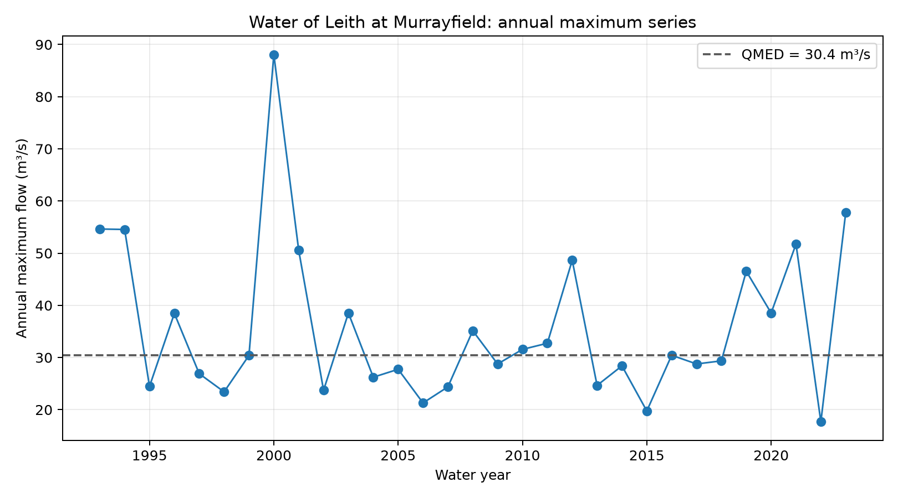
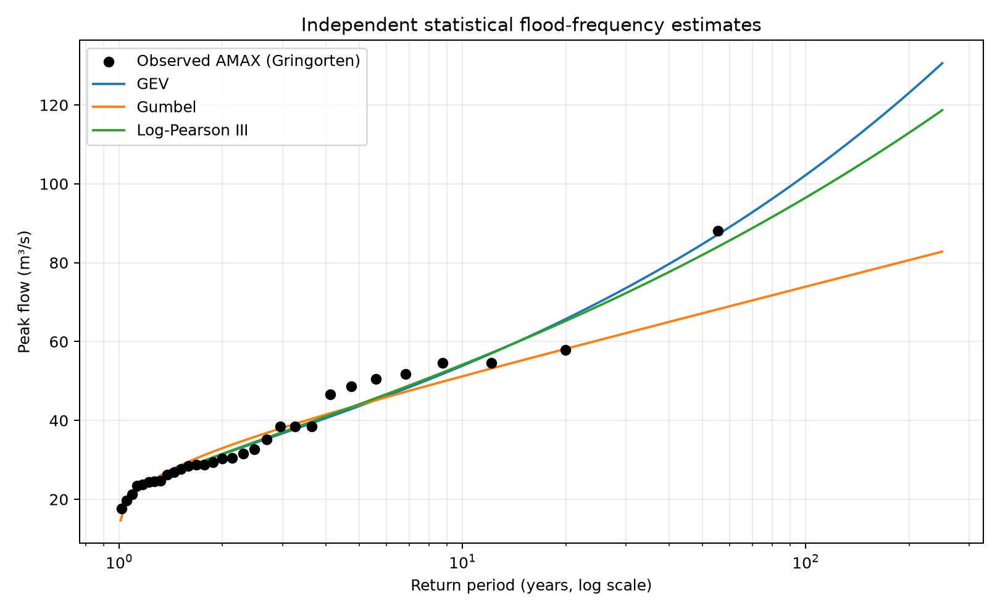

# Flood hydrology of the Water of Leith at Murrayfield

[](https://github.com/MohaAbdipour/water-of-leith-flood-hydrology/actions/workflows/tests.yml)

This study examines the observed high-flow regime of the Water of Leith at
Murrayfield, Edinburgh (NRFA station 19006; UK-Flow15 station 019006). It uses
15-minute discharge observations to construct a hydrological water-year annual
maximum series and quantify how design-flow estimates depend on statistical
model choice and sampling uncertainty.

The Murrayfield gauge drains 107 km². The catchment is described by the National
River Flow Archive as relatively impervious and flashy, with urban influence,
combined sewer overflows, three headwater reservoirs and regulated runoff. The
gauging record also requires care because hydraulic controls and flood-defence
works have affected the stage–discharge relation.

## Data

The analysis uses **UK-Flow15**, an openly licensed, quality-controlled national
archive of sub-hourly discharge:

> Fileni, F. et al. (2025). *Sub-hourly river flow data observations from 1369
> river gauges in the UK, 1948–2023 (UK-Flow15).* NERC EDS Environmental
> Information Data Centre. https://doi.org/10.5285/211710ac-f01b-4b52-807f-373babb1c368

The dataset is available under the UK Open Government Licence. Raw data are not
duplicated in this repository; the download script retrieves station `019006`
and its metadata directly from the official catalogue. This keeps provenance
explicit and avoids maintaining an uncontrolled copy of the source archive.

## Record integrity

The downloaded station file contains 1,107,420 observations from 1 June 1992 to
31 December 2023. Checks found:

- no missing discharge values;
- no duplicate timestamps;
- no breaks in the 15-minute sequence;
- no negative flows;
- four `006` observations, denoting high flows validated by antecedent rainfall
  and concurrent regional high flow in the UK-Flow15 documentation.

Only complete October–September water years are retained, giving 31 annual
maxima for water years 1993–2023.

## Initial results



The at-site median annual flood, calculated directly from the observed annual
maxima, is **QMED = 30.41 m³/s**. The largest value is **88.08 m³/s** in water
year 2000.



| Model | Q10 (m³/s) | Q100 (m³/s) | Bootstrap 95% interval for Q100 (m³/s) |
|---|---:|---:|---:|
| GEV | 53.86 | 102.20 | 58.66–211.77 |
| Gumbel | 51.20 | 73.92 | 57.64–92.59 |
| Log-Pearson III | 54.15 | 96.49 | 57.71–177.53 |

The similar Q10 estimates but divergent Q100 estimates show how strongly tail
assumptions influence extrapolation beyond a 31-year record. The intervals are
non-parametric bootstrap intervals that refit each model in every resample; they
represent sampling and parameter uncertainty, but not rating-curve, temporal
non-stationarity or model-structure uncertainty.

## Relation to UK FEH practice

This is an **independent at-site statistical analysis informed by UK flood
estimation practice**, not a formal FEH assessment. It does not use paid FEH Web
Service data, WINFAP or ReFH2, and it does not reproduce licensed FEH inputs.

A formal design-flow study would assess the latest FEH statistical method,
donor adjustment, pooling groups, hydrological similarity, catchment descriptors,
rating quality and other local evidence. The open estimates here provide a
transparent baseline for a future comparison if appropriately licensed FEH
results become available.

## Reproduce the analysis

```bash
python -m venv .venv
source .venv/bin/activate          # Windows: .venv\Scripts\activate
pip install -e ".[dev]"
python scripts/download_ukflow15.py
python scripts/run_analysis.py
pytest
```

The analysis writes QA diagnostics, annual maxima and fitted return levels to
`outputs/`, and regenerates both figures in `docs/figures/`.

## Scientific limitations

- The sub-hourly record begins in 1992; estimates of rare floods require
  substantial extrapolation.
- UK-Flow15 quality codes support screening but do not replace appraisal of the
  underlying rating curve and station history.
- The 2016–2017 flood-defence works and subsequent rating revision may affect
  temporal comparability of high flows.
- Reservoir operation, regulation and urban drainage complicate assumptions of
  independent and identically distributed annual maxima.
- No trend or non-stationary extreme-value model is yet applied.
- Results must not be used for engineering design, planning decisions or
  operational flood management.

## Next analyses

1. Compare the 15-minute annual maxima against the official NRFA peak-flow
   series and investigate discrepancies.
2. Extract independent peaks over threshold and fit a Generalised Pareto model.
3. Test temporal change points, trends and sensitivity to the 2016–2017 works.
4. Add rainfall-linked event hydrographs when a suitable openly licensed rainfall
   record is confirmed.
5. Compare the transparent estimates with legitimately obtained FEH results,
   without redistributing licensed inputs.

## Software licence

The analysis code is released under the MIT License. Source hydrometric data
retain their original Open Government Licence and attribution requirements.

